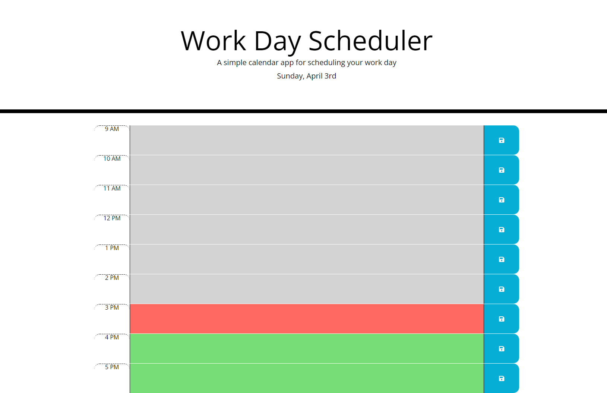

# Work Day Scheduler

## Purpose
This website is designed to act as a simple planner for a 9 to 5 work day. It allows the user to enter and delete events which will be saved when they close the website. The planner will update based on the time automatically if it is left open.

This website also serves as a submission to an assignment that tests students' skills with HTML, CSS, and JavaScript while focusing on the use of third party API's like Jquery, Bootstrap, and Moment.js. 

## Built With
* HTML
* CSS
* JavaScript
* Jquery
* Bootstrap
* Moment.js
* Font Awesome

## Website Link
https://mazattack1999.github.io/calendar/

## Contribution
* JavaScript by Micah Zahn

## Screenshot

